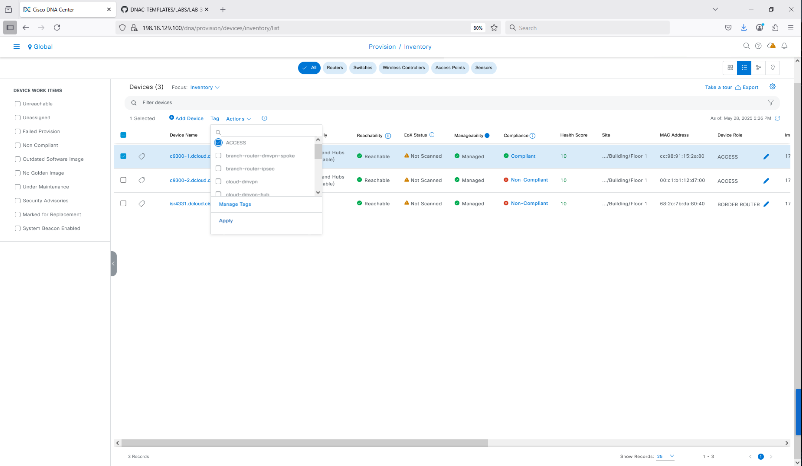
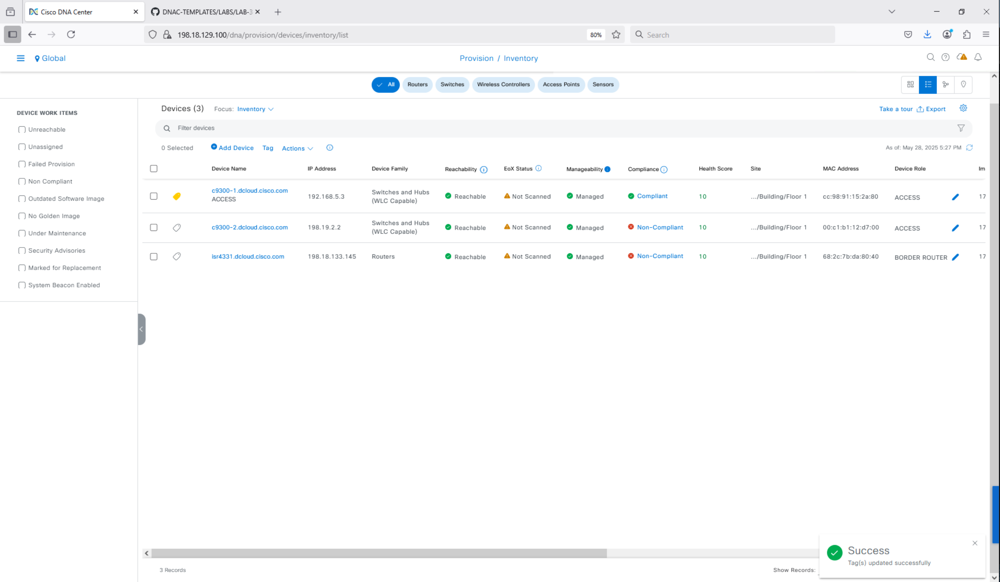
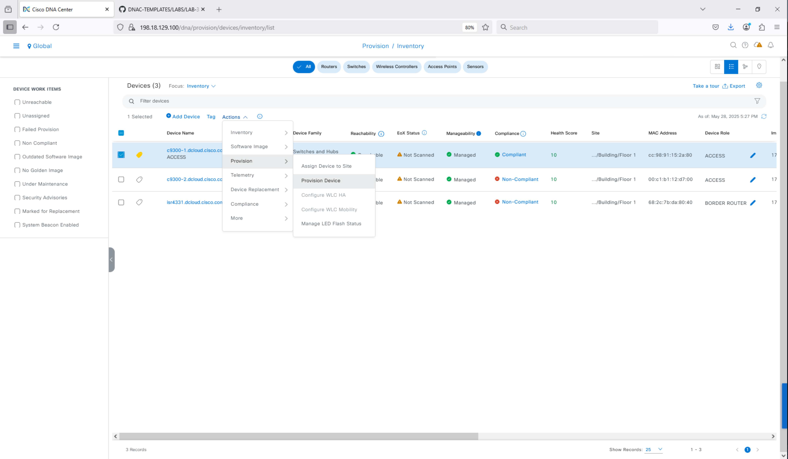
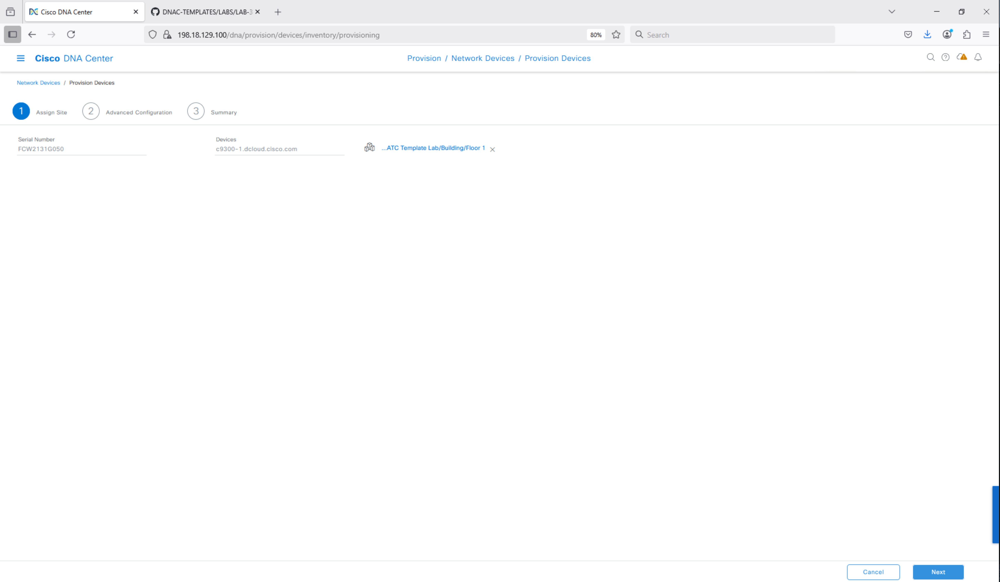
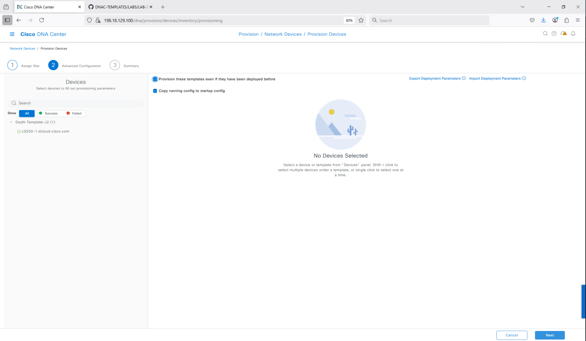
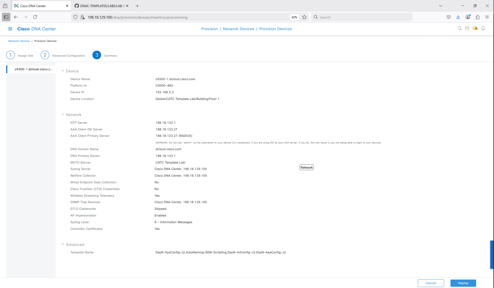
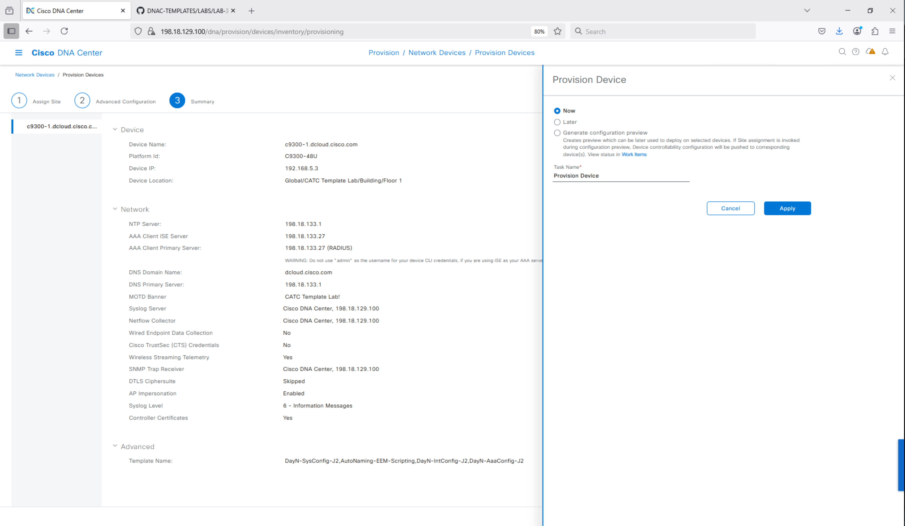
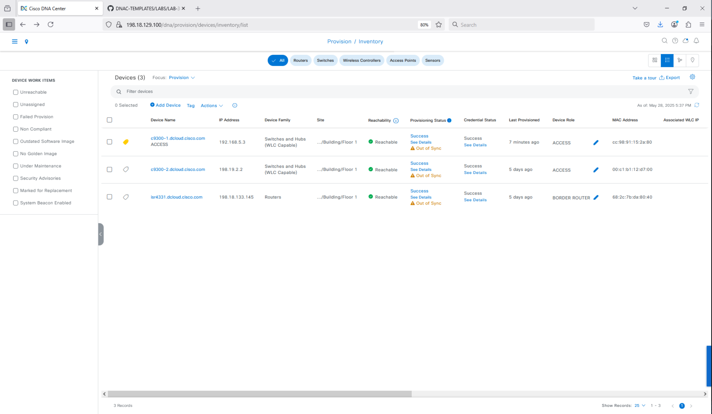

# DayN provisioning workflow

How a Composite DayN template (designed per
[dayn-template-design.md](dayn-template-design.md)) is attached to a
Network Profile and pushed to a device that has completed PnP and is in
Inventory.

## 1. The single-Network-Profile-per-site rule

> Only **one switching Network Profile** may be assigned to a given site.
> If a Network Profile already exists for the target site (because a PnP
> Onboarding template was attached there — see
> [pnp-claim-workflow.md §2](pnp-claim-workflow.md#2-network-profile-attachment)),
> **modify the existing profile**. Do not create a second one.

Implication: the same Network Profile carries both the **Onboarding
Template** (used once at claim) and the **DayN Template(s)** (used on
every Provision run).

## 2. Differentiating template variants by device role with TAGs

Many sites mix device roles on the same platform — for example, two
C9300s where one is an access switch and the other is a distribution
switch. Both inherit the same site Network Profile, but you want
different DayN content per role.

The pattern: attach **multiple** DayN templates (or Composites) to the
profile, then **scope each one by Device TAG** so Catalyst Center picks
the right Composite per device at provision time.

### Create and assign TAGs

1. **Provision → Network Devices → Inventory**.
2. Select the device on the left (e.g. `c9300-1`).
3. Click **Tag** → type the tag name (e.g. `ACCESS`) into the search
   field → click **Create new tag (ACCESS)**.
4. Repeat for the distribution switch with tag `DISTRO`.

Tags also work for fleet operations beyond provisioning (filtering,
compliance scope, RBAC) so it pays to standardize a tag taxonomy early.

## 3. Attaching the Composite to the Network Profile

1. **Tools → Template Hub**.
2. Filter the list to the DayN project (e.g. `DayN-Templates-J2`).
3. Locate the Composite (e.g. `PnP-Templates-J2`) and click **Attach**.
4. Select the target site in the hierarchy and click **Save**.

If the profile is shared between roles, repeat with a second Composite
and scope each by its TAG (`ACCESS` / `DISTRO`).

## 4. Provision Device workflow

1. **Provision → Network Devices → Inventory**.
2. Tick the device(s) to provision.
3. **Actions → Provision → Provision Device**.

### Section 1 — Site assignment

The device is already in a site because PnP placed it there. Confirm and
click **Next**.

### Section 2 — Settings & templates

Select the device on the left. Verify the two top checkboxes (network
settings + templates) are ticked so both Design-emitted CLI and the
Composite template render in the preview. Click **Next**.

### Section 3 — Review

Review the rendered CLI block. Catalyst Center shows exactly what will be
pushed — both the Design-Settings output and the Composite template
output, in execution order. Click **Deploy**.

### Section 4 — Schedule

Choose **Now** to deploy immediately, or schedule for a later time.
Click **Apply**.

### Monitoring

Return to Inventory and switch the **Focus** dropdown to **Provisioning**
to monitor in-flight pushes.

## 5. The Design-vs-template conflict warning

> **If you populate the UI with settings, those parameters should NOT be
> in your templates as they will conflict, and the deployment through
> provisioning will fail.** While it is easy to populate Design settings,
> it is best to test with a single switch first to confirm exactly which
> CLI Design pushes before finalizing the template.

In practice:

- Run the Provision workflow on one device.
- Inspect the CLI block in the Section 3 review **and** the running config
  on the device afterward.
- Identify any line emitted by Design that also appears in your template.
- Remove the duplicate from the template, not from Design (Design is the
  authoritative source for inventory-wide settings).

This is the most common cause of DayN provisioning failures — see also
[considerations.md §5](considerations.md#5-design-settings-vs-template-configuration--no-overlap).

## 6. After provisioning

Once provisioning completes:

- The device is **compliance-tracked** for everything in the DayN
  Composite. Drift detection will flag any out-of-band changes against
  the rendered template content.
- Re-provisioning is non-destructive provided the template is idempotent
  (see [dayn-template-design.md §7](dayn-template-design.md#7-idempotency-for-re-pushable-dayn)).
- Template updates propagate by re-running **Provision Device** — there
  is no separate "re-push template" action.
