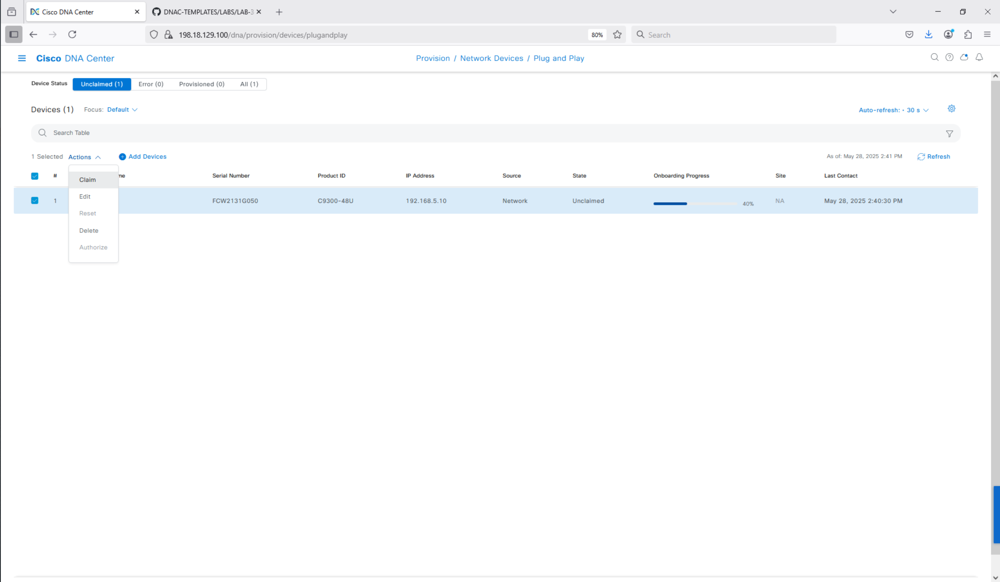
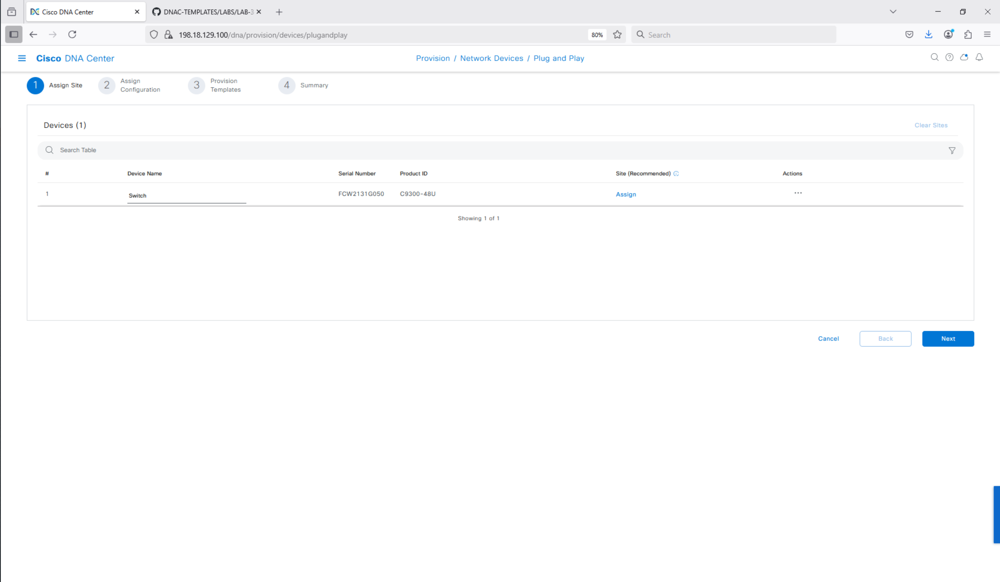
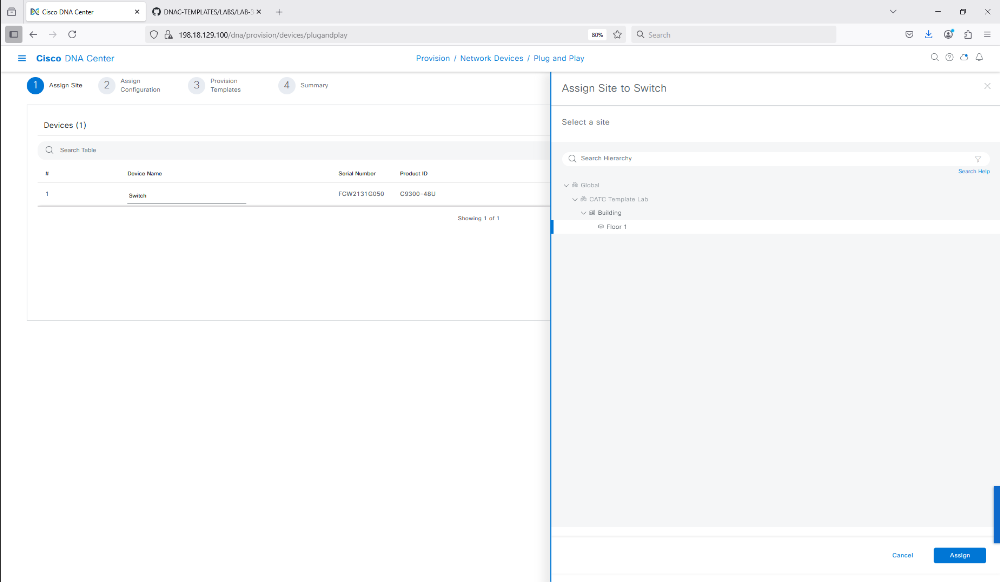
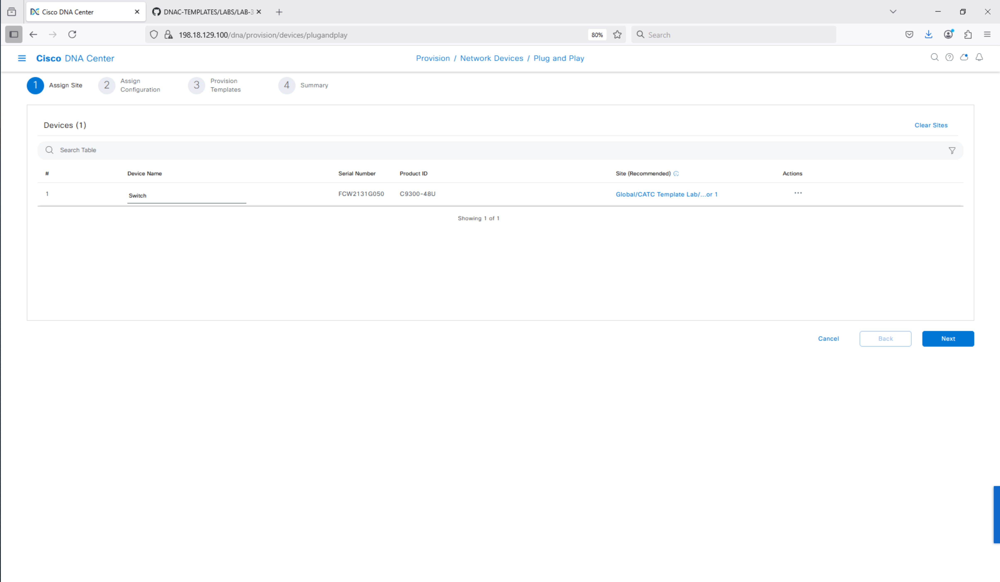
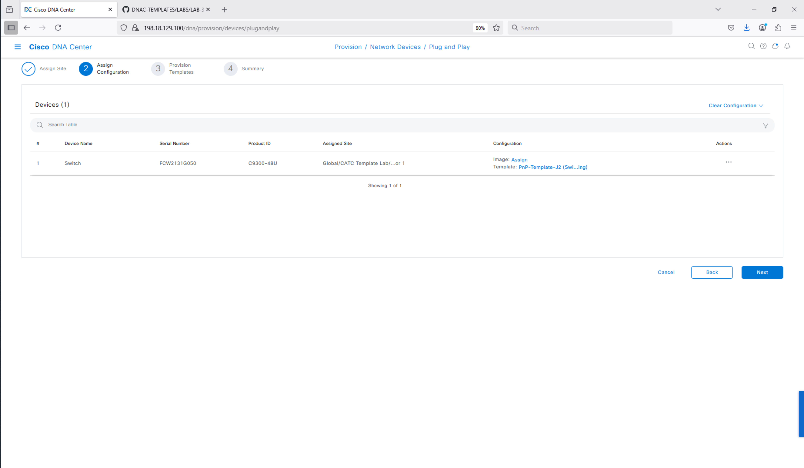
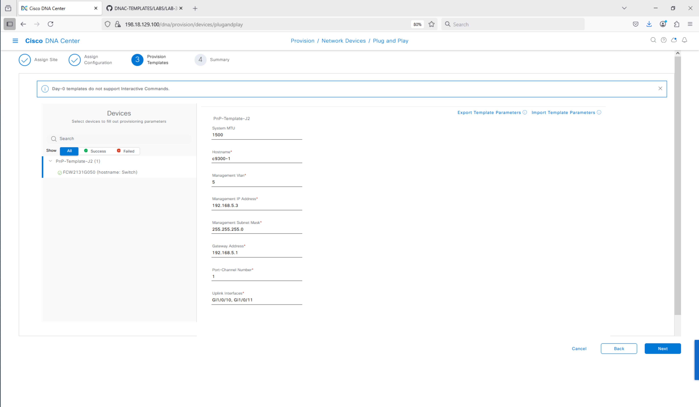
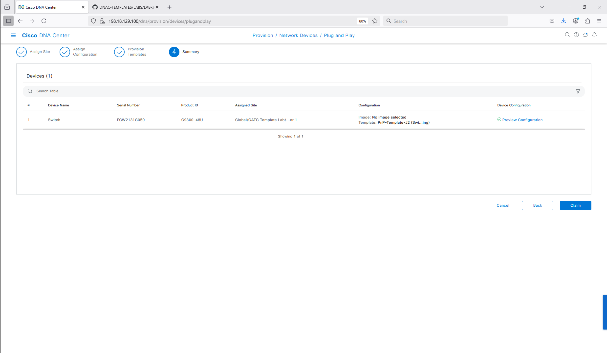
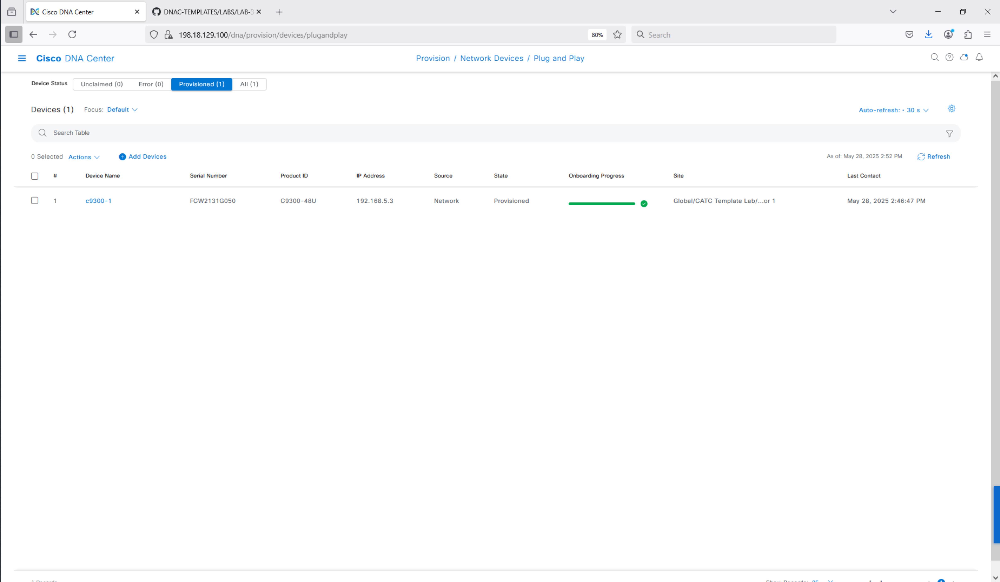
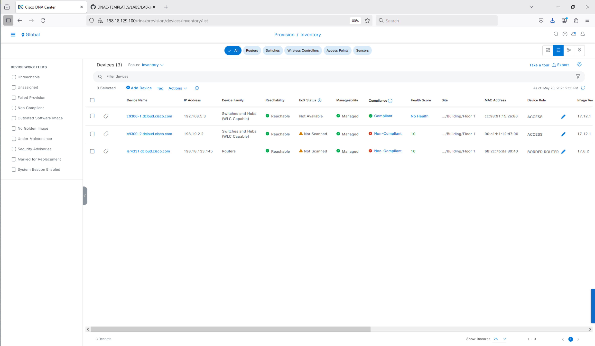

# PnP claim workflow and operationalization

How an Onboarding template (designed per
[pnp-template-design.md](pnp-template-design.md)) is attached to a Network
Profile and pushed to a factory-default device through the PnP claim
workflow. Read [considerations.md](considerations.md) for the underlying
rules.

## 1. Flat-file vs line-by-line delivery

DayN templates push CLI **line by line** over an SSH session. PnP templates
are different: the rendered Onboarding template is transferred to the device
as a **single flat file** over HTTP/HTTPS.

This matters when the template reconfigures management connectivity itself.
Line-by-line delivery would disconnect mid-push the moment the mgmt IP or
uplink changes; flat-file delivery applies the entire configuration
atomically, so the device can come up on the new address without the push
ever stalling.

Pair this with the source-interface bindings in the PnP template (especially
`ip http client source-interface`): the device informs Catalyst Center of
its new IP through the HTTP client, and Inventory updates automatically once
PnP completes.

## 2. Network Profile attachment

A PnP template is not directly assigned to devices — it is attached to a
**Network Profile**, and the profile is assigned to a site in the hierarchy.

Steps:

1. **Design → Network Profiles → Add Profile → Switching**.
2. Name the profile.
3. **Onboarding Template** tab → **Add Template** → pick the PnP template
   (project: `Onboarding Configuration`). Only templates in that project
   are offered here.
4. Save the profile.
5. **Assign** the profile to one or more sites in the hierarchy.

For switches, only one switching Network Profile may be assigned to a given
site. If a profile already exists for the target site, **modify it** rather
than creating a new one — see [dayn-provisioning.md](dayn-provisioning.md)
§1 for the rule and its implications.

## 3. Importing a PnP template (fallback)

If the template was authored elsewhere or sourced from this repo's
`examples/jinja2/`, import it instead of rebuilding:

1. **Tools → Template Hub → Import → Template(s)**.
2. Select **Onboarding Configuration** as the project.
3. Choose the `.json` export file and import.

The imported template appears in the project and can be attached to a
Network Profile exactly like a hand-authored one.

## 4. Claim workflow

With Network Profile attached to a site and the factory-default device
plugged in and reachable (DHCP option 43 / DNS pointing to Catalyst Center),
the device appears under **Provision → Plug and Play**.

### Section 1 — Assign site

Pick the site in the hierarchy that owns the Network Profile carrying the
Onboarding template.

### Section 2 — Templates & image review

The site assignment auto-selects the templates and golden image bound to
the Network Profile. The wizard exposes hyperlinks to inspect or override
both. For a standard onboarding leave the defaults and continue.

### Section 3 — Variable entry

This is where the form built in the **Variables** tab of the PnP template
(see [pnp-template-design.md §4](pnp-template-design.md#4-variables-form-tab--field-name--type--default-mapping))
is presented to the operator. One row per device, selectable by serial
number on the left.

Typical entries for the canonical L2 onboarding template:

| Field                   | Value                |
|-------------------------|----------------------|
| Hostname                | `c9300-1`            |
| Management Vlan         | `5`                  |
| Uplink Interfaces       | `Gi1/0/10, Gi1/0/11` |
| Management IP Address   | `192.168.5.3`        |
| Management Subnet Mask  | `255.255.255.0`      |
| Gateway Address         | `192.168.5.1`        |
| Port-Channel Number     | `1`                  |
| System MTU              | `1500` (default)     |

Defaults set on the form survive into this step — operators only have to
change values that differ from the default for that device.

### Section 4 — Review and Claim

The wizard renders the final CLI block (the auto-deployed mandatory config
from [considerations.md §3](considerations.md#3-mandatory-auto-config-deployed-by-catalyst-center-at-claim)
plus the template-rendered output). Click **Claim** → **Yes**.

## 5. Claim lifecycle

The device transitions through three observable states:

| State | Meaning |
|-------|---------|
| **Planned** | Claim recorded. Catalyst Center is waiting for the device to call home (or for an already-online device to receive the flat-file push). |
| **Onboarding** | Flat file delivered; device is applying configuration and re-establishing the management session on the new address. |
| **Provisioned** | Configuration applied; device has appeared in Inventory and synced. |

After the **Provisioned** state, the device shows up in the device
**Inventory** with the hostname and management IP supplied via the
template. From this point the device is eligible for DayN templates and
ongoing provisioning — see [dayn-provisioning.md](dayn-provisioning.md).

## 6. Common failure modes

- **Variable referenced only inside a conditional fails to register.** Use
  the `!{{Var}}` first-use workaround (see
  [pnp-template-design.md §2](pnp-template-design.md#5-iteration-5--system-mtu-guard-source-interface-block-svi-hardening-and-the-portchannel-workaround)).
- **Empty `__device` / `__interface`.** PnP cannot bind to inventory; if
  the template uses these it must be a DayN template. See
  [prompts/debug/pnp-vs-dayn-binding.md](../../prompts/debug/pnp-vs-dayn-binding.md).
- **CLI conflicts with Design Settings.** Overlap between Design app and
  template content causes provisioning failures — keep AAA/NTP/SNMP/syslog
  in Design *or* in templates, never both.
- **Compliance scan shows post-claim drift the operator did not make.**
  Expected: PnP-deployed content is not tracked. Move the affected
  configuration into a DayN template if compliance coverage is needed.
