# Variables [](https://developer.cisco.com/codeexchange/github/repo/kebaldwi/DNAC-TEMPLATES)

Variables are used to allow scripts or code for that matter to be reused. A variable within a script allows us to replace the data on demand thereby allowing the reuse of parts of or entire templates. Variables may be defined in a couple of ways but the data entered will either numerical or string. A numerical value is just that a number where as a string is either a line of text or perhaps just a name.

## Velocity Variables

In this section we will go into the various aspects of Velocity Variables and nomenclature.

```vtl
    Variable reference:     #set( $monkey = $bill )
    String literal:         #set( $monkey.Friend = 'monica' )
    Property reference:     #set( $monkey.Blame = $whitehouse.Leak )
    Method reference:       #set( $monkey.Plan = $spindoctor.weave($web) )
    Number literal:         #set( $monkey.Number = 123 )
    Range operator:         #set( $monkey.Numbers = [1..3] )
    Object list:            #set( $monkey.Say = ["Not", $my, "fault"] )
    Object map:             #set( $monkey.Map = {"banana" : "good", "roast beef" : "bad"})
```

### Variable Notation

The Notation used in variables is as follows: 

   $[{]identifier.identifier[|alternate value][}]

Usage:
   * identifier: variable name
   * alternate value: alternate expression to use if the property is null, empty, false or zero

Types of Notation:

```vtl
    $[{]identifier.identifier([ parameter list... ])[|alternate value][}]
    
    Formal Notation:        ${Switch} 
    Regular Notation:       $Switch
    Alternate Value:        ${Switch.name|'ASW-C9300-ACCESS'}
```

Data may be set to the variables via a set command

```vtl
#set( $StringVariable = "text" )
#set( $NumericVariable = 10 )
```

### Arrays (aka Ordered Lists):

It is possible to create arrays as well which can be iterated through with Foreach loop constructs. In Velocity we call an array a list. You can set a list up in two ways:

* Define all the elements of the list in one line comma delimited 
* Define each element of the list with an identifier

Both examples follow:
```vtl
#set( $L2vlans = ["10" , "18"] )
```

```vtl
#set( $L2Vlans = [] )
#set( $L2Vlans[0] = 10 )
#set( $L2Vlans[1] = 18 )
```

Additional set commands available are the following:

```vtl
    Variable reference:    #set( $monkey = $bill )
    String literal:        #set( $monkey.Friend = 'monica' )
    Property reference:    #set( $monkey.Blame = $whitehouse.Leak )
    Method reference:      #set( $monkey.Plan = $spindoctor.weave($web) )
    Number literal:        #set( $monkey.Number = 123 )
    Range operator:        #set( $monkey.Numbers = [1..3] )
    Object list:           #set( $monkey.Say = ["Not", $my, "fault"] )
    Object map:            #set( $monkey.Map = {"banana" : "good", "roast beef" : "bad"})
```

Simple arithmetic expressions can be accomplished as follows:

```vtl
    Addition:       #set( $answer = $number + 1 )
    Subtraction:    #set( $answer = $number - 1 )
    Multiplication: #set( $answer = $number * $mod )
    Division:       #set( $answer = $number / $mod )
    Remainder:      #set( $answer = $number % $mod )

    where $number = 10 and $mod = 2 the answers from above would be for:
    
    Addition:       $answer = 11
    Subtraction:    $answer = 9
    Multiplication: $answer = 20
    Division:       $answer = 5
    Remainder:      $answer = 0
```

### Modifiers

With variables there are modifiers that can be used to do specific operations with regard to variables. Modifiers can be used to determine size, split, add or even replace data. Take a look at the following:


1. An example that splits a string result using on a specific character as a delimeter and fills an array $StackPIDs.
   ```vtl
   #set( $StackPIDs = $ProductID.split(",") )
   ```

2. This example determines the number of elements in an array.
   ```vtl
   #set( $StackMemberCount = $StackPIDs.size() )
   ```

3. This example uses a regular expression to reduce the PID of a switch to either 24 or 48 to reflect port count.
   ```vtl
   #set( $PortCount = $Model.replaceAll("C9300L?-([2|4][4|8]).*","$1") )
   ```

4. This last example adds the value of $PortCount as a new element appending it within the array $PortTotal
   ```vtl
     #set( $foo = $PortTotal.add($PortCount) )
   ```

## Jinja2 Variables

In this section we will go into the various aspects of Jinja2 Variables and nomenclature as they are used on Catalyst Center for templating.

[//]: # ()
```j2
    Variable reference:     
    String literal:         
    Integer literal:        
    Range operator:         
    List:                   
    Object map:             
    Object list:            
```

### Variable Notation

The Notation used in variables is as follows: 

   [{{]identifier.attribute|modifier|['attribute'][}}]

It’s important to know that the outer double-curly braces are not part of the variable, but the print statement. If you access variables inside tags don’t put the braces around them.

Usage:
   * identifier: variable name
   * attribute value: attributes are variables within a variable creating a variable set if used

Types of Notation:

```j2
    {{ identifier.attribute|modifier|['attribute'] }}
    
    Formal Notation:        {{ Switch }} 
```

Data may be set to the variables via a set command

```j2


```

### Arrays(aka Ordered Lists):

It is possible to create arrays as well which can be iterated through with Foreach loop constructs. In Velocity we call an array a list. You can set a list up in two ways:

* Define all the elements of the list in one line comma delimited 
* Define each element of the list with an identifier

Both examples follow:
```j2

```

### Objects (Dictionaries):

It is also possible to create objects (dictionaries) which can then be referenced through similar looping constructs. A dictionary is a collection of `key : value` pairs. Keys must be quoted; values may be strings, numbers, booleans, lists, or other dictionaries.

```j2
{# Simple dictionary — one record #}


{# Access an element of the dictionary — bracket form #}
{{ monkey['banana'] }}     {# renders: good #}

{# Access an element of the dictionary — attribute form (only valid for identifier-safe keys) #}
{{ monkey.banana }}        {# renders: good #}

{# Hyphenated / spaced keys MUST use bracket access #}
{{ monkey['roast beef'] }} {# renders: bad #}
```

#### List of Dictionaries (the canonical VLAN pattern)

The most common shape in Catalyst Center templates is a **list of dictionaries** — every element of the list is a dictionary with the same keys. This lets you describe a whole VLAN database (or any other tabular per-site dataset) and iterate it with a single `` loop. The example below is the minimal form used in [examples/jinja2/VLAN-Configuration.j2](../examples/jinja2/VLAN-Configuration.j2):

```j2
{# Dictionary of VLANs per site — name + number only #}


{# Walk the list, generate vlan/name CLI #}

vlan {{ vlanpair['vlan'] }}
 name {{ vlanpair['name'] }}

```

The same shape can be extended with additional keys — here each VLAN also carries IP, mask, and DHCP helper for SVI configuration:

```j2
{# Dictionary of VLANs per site — with L3 addressing #}
{% set SiteAvlansLibrary = [
  {'vlan':'5',   'name':'mgmtvlan',     'ip':'192.168.5.1',  'mask':'255.255.255.0', 'dhcp':'198.18.133.1'},
  {'vlan':'10',  'name':'apvlan',       'ip':'192.168.10.1', 'mask':'255.255.255.0', 'dhcp':'198.18.133.1'},
  {'vlan':'20',  'name':'datavlan',     'ip':'192.168.20.1', 'mask':'255.255.255.0', 'dhcp':'198.18.133.1'},
  {'vlan':'30',  'name':'voicevlan',    'ip':'192.168.30.1', 'mask':'255.255.255.0', 'dhcp':'198.18.133.1'},
  {'vlan':'40',  'name':'guestvlan',    'ip':'192.168.40.1', 'mask':'255.255.255.0', 'dhcp':'198.18.133.1'},
  {'vlan':'999', 'name':'disabledvlan', 'ip':'192.168.99.1', 'mask':'255.255.255.0', 'dhcp':'198.18.133.1'}
  ]%}

{# Build SVIs from the same data — note the per-record branch on a key value #}

vlan {{ vlanpair['vlan'] }}
 name {{ vlanpair['name'] }}

pnp startup-vlan {{ vlanpair['vlan'] }}

interface vlan {{ vlanpair['vlan'] }}
 description {{ vlanpair['name'] }}
 ip address {{ vlanpair['ip'] }} {{ vlanpair['mask'] }}
 ip helper-address {{ vlanpair['dhcp'] }}
 ip ospf 1 area 0
 no shutdown


```

Wrap that loop in a `` once and call it from any site template:

```j2

  
    vlan {{ vlanpair['vlan'] }}
     name {{ vlanpair['name'] }}
  


{{ configure_vlans(SiteAvlans) }}
```

Other natural shapes for the same idiom — different keys, same structure:

```j2
{# Per-port deployment codes #}


{# Per-role uplink interface metadata #}

```

#### Searching / filtering a list of dictionaries

Catalyst Center's Jinja2 has no built-in SQL-like filter, so the standard pattern is a plain `` with ``. Declare the accumulator **before** the loop (or before the macro that owns it) so the appended values are visible after the loop finishes:

```j2



  
    
  
    
  
    
  


{# Renders the matched VLAN ids joined with commas #}
switchport trunk allowed vlan {{ vlanArray | join(',') }}
```

A shorter form using `map(attribute=...)` pulls one field from every record:

```j2
switchport trunk allowed vlan {{ SiteAvlans | map(attribute='vlan') | join(',') }}
```

For a complete worked example — including the dual-uplink STP / Port-channel macros that consume these lists-of-dicts — see [Dictionaries](./jinja2/dictionaries.md) and [examples/jinja2/VLAN-Configuration.j2](../examples/jinja2/VLAN-Configuration.j2).

### Modifiers

With variables there are modifiers that can be used to do specific operations with regard to variables. Modifiers can be used to determine size, split, add or even replace data. Take a look at the following:


1. An example that splits a string result using on a specific character as a delimeter and fills an array $StackPIDs.

   ```j2
   
   ```

2. This example determines the number of elements in an array.

   ```j2
   
   ```

3. This example uses a regular expression to reduce the PID of a switch to either 24 or 48 to reflect port count.

   ```j2
   
   ```

4. This last example adds the value of $PortCount as a new element appending it within the array $PortTotal

   ```j2
   
   ```
[//]: # ()
## Catalyst Center & Working with Variables

As with anything Catalyst Center the UI allows for flexibility and the ability to not only further define how the Variables are populated but how they are used during the provisioning workflows. 

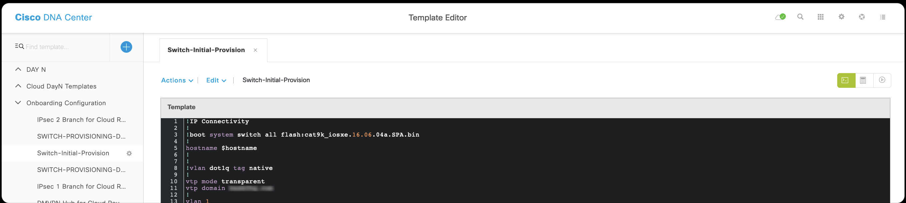

Once Variables have been scripted within the Template, You can click on the **form editor button** *(middle icon)* at the top right of the template form.

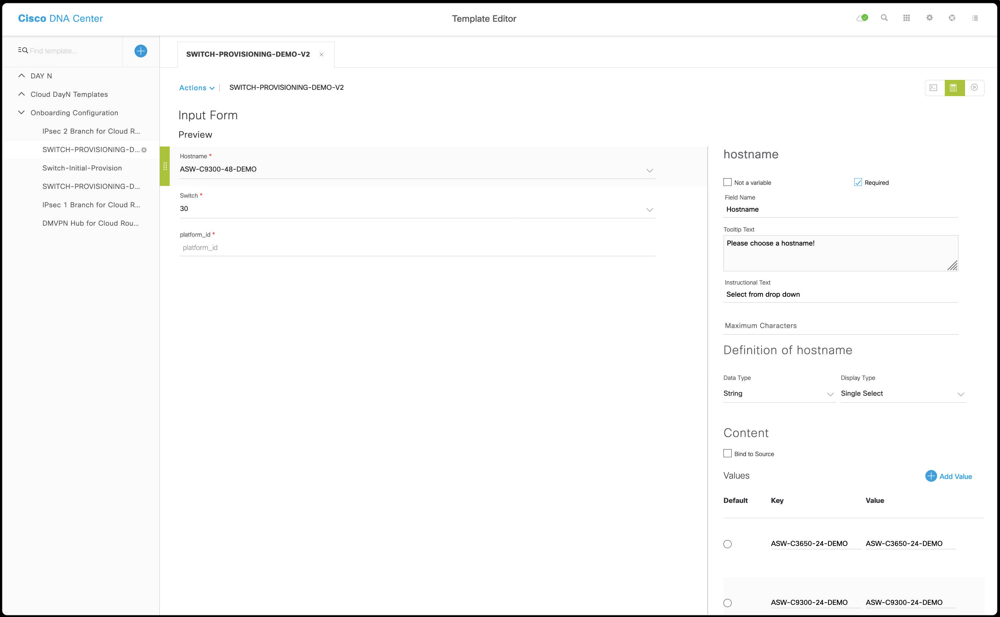

Within the input form select the variables within the script and one at a time edit the form that they will take during provisioning on the right.

#### Variable Naming and Instructional Text

On each variable the form will appear in the with the name of the text used in the script pasted. The variable $hostname would appear as the following:

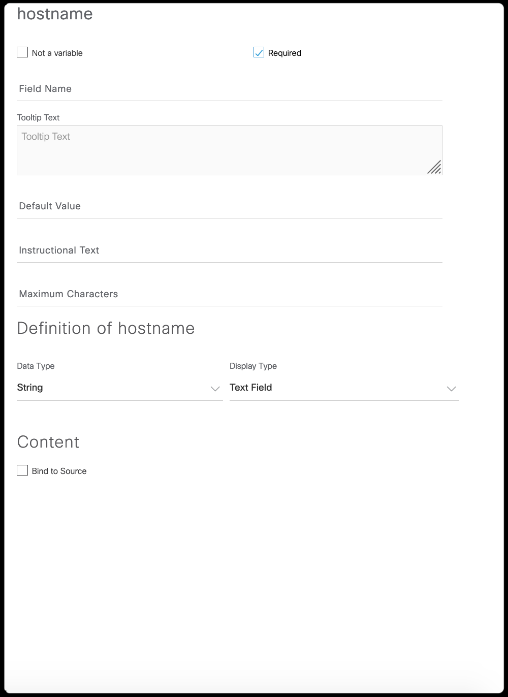

At that point start by choosing a *Field Name* to be used in the form, perhaps something more descriptive of meaningful. For this variable you might capitalize it to read Hostname.

The next field is *Tool Tip* which is a text box allowing for the entry of information to describe what to enter for the variable, and would appear as ALT text when moused over on the UI.

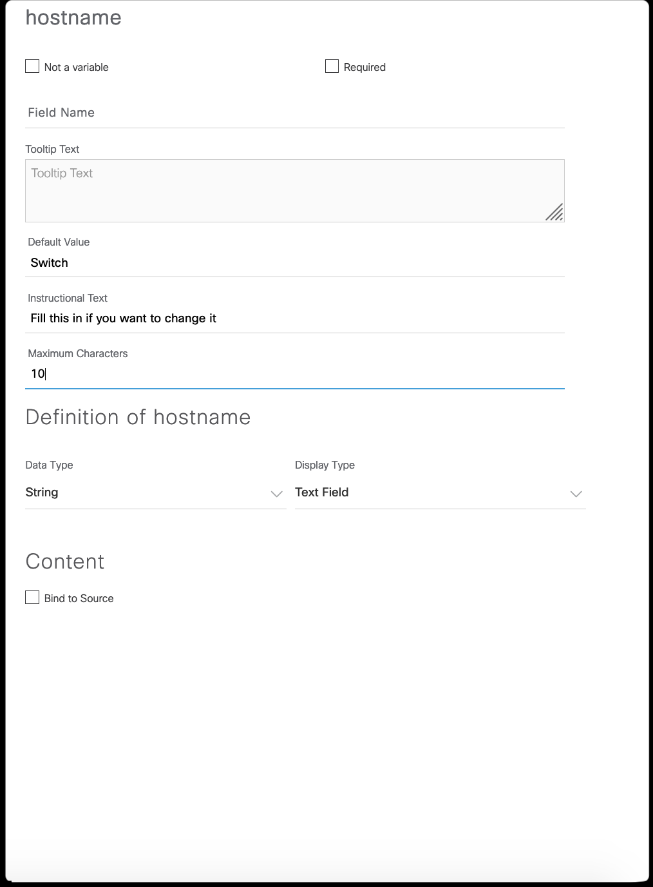

Additionally fill in perhaps the *Default Value* if not provided in the script. The default value will be populated in the form for submission during provisioning. This field is used when a string text entry variable is defined. *Instructional Text* appears if the default value is not used, or is deleted, and gives guidenace to how to fill in the required data. *Maximum Characters* is the maximum number of ascii characters that may be entered. This can be used for uniform lengths of data.

#### Defining Variables

The next step is *Variable Definition*. Similarly to the scripting and using the set command, we define variables as numeric or string type variables. Additionally though we have IP Address and MAC Address formats. In the UI this selection process is done through a dropdown selection menu.

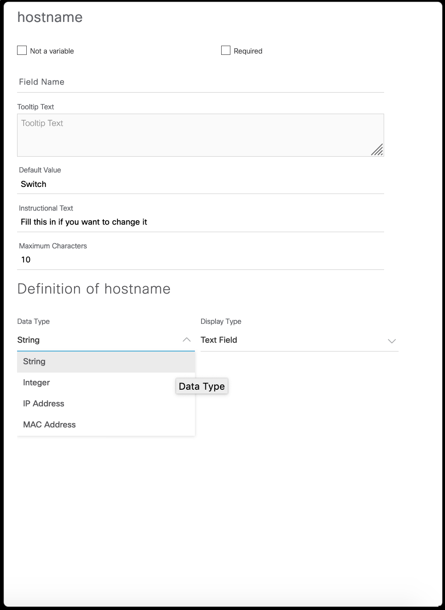

To the right is the *Display Type* field which again is a dropdown selection menu allowing for the text, single and multi select types of entry within the form shown below.

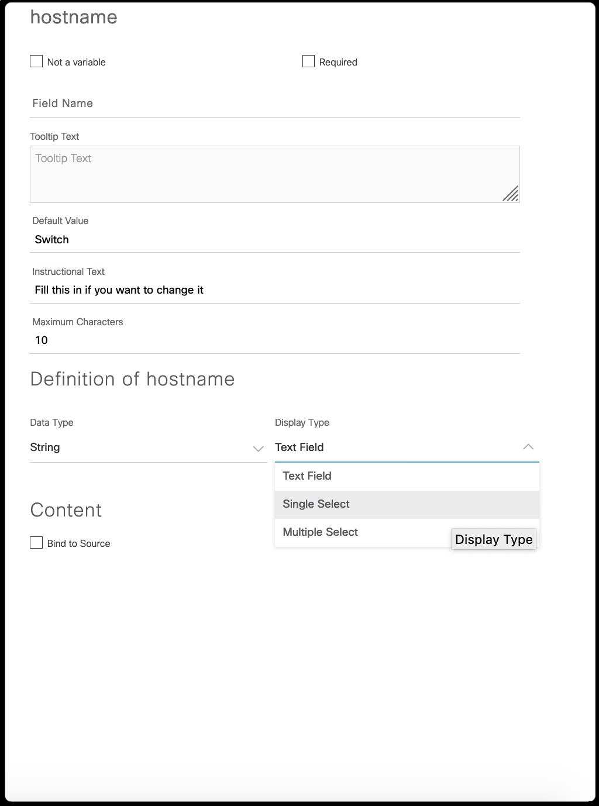

**Text** allows for text entries and will use the default value field if entered. **Single** and **Multi Select** will allow you to select a data point as a default value within the data added as shown. each time the add button is clicked another choice is entered to the single choice list. 

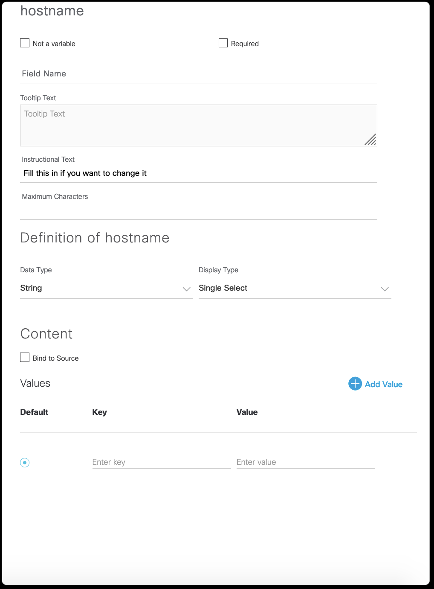

The first line is by default blank at first and as the only line is the *Default* but that may be moved to any other line added. The *Key* field is what appears as your selection but this may be the data you want used on the device or may be just a representative value in the list. The *Value* is the value used by the script on the device.

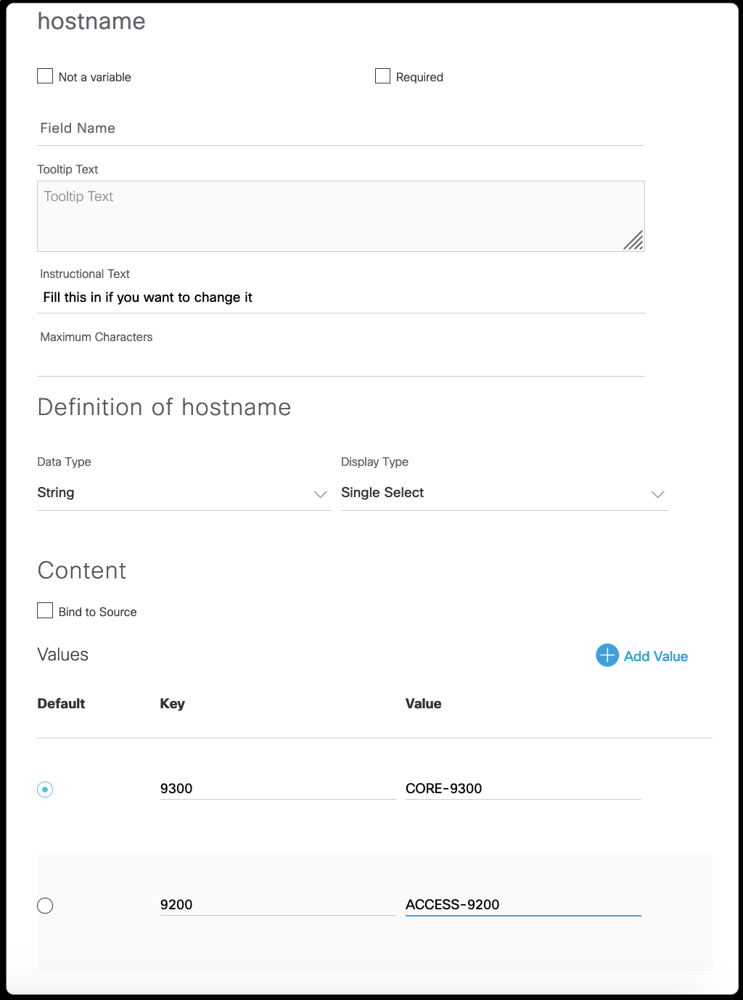

#### Bind Variables

Within Catalyst Center it is possible to Bind Variables to devices. Within Catalyst Center versions 1.2 and 1.3 this can only be used and populated by the device for use in **DayN Templates**. When used in **Onboarding Templates** the variable is not populated at this time although we believe that to be a roadmap item. Once the device is in the inventory this data populated by the dvice during onbaording may be used throughout the script to make decisions. For example if it is a 48 port 9300 the product ID would be populated with C9300-48U and so you can make decision trees to program 48 ports based off that value. See DayN Templates for more information.

##### Building a Bind Variable

1. Build the variable as single select variable

   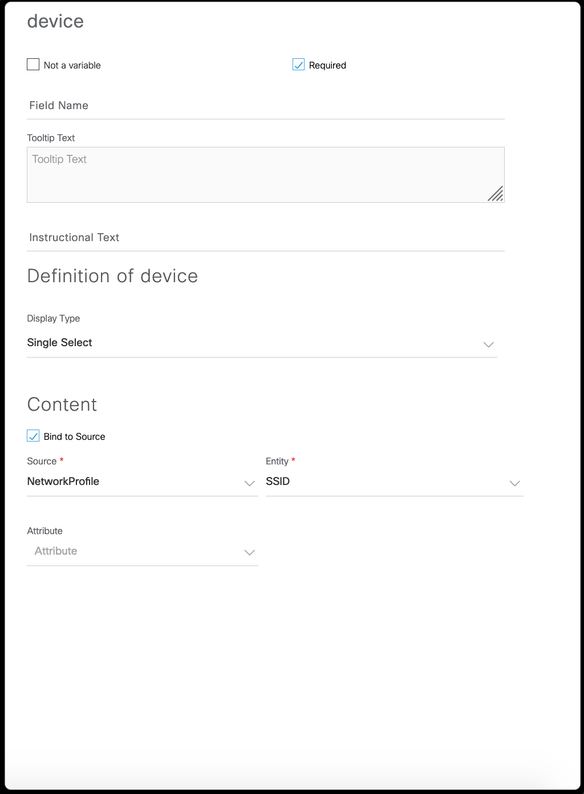

2. Select the option *Bind to Source* as above
3. Choose the *Source* use the drop down and select from as shown in image below:
   - Network Profile     *-use this option for SSID*
   - Common Settings     *-use this option to poll settings like ntp, dns*
   - Cloud Connect       *-use this option to poll tunnel information*
   - Inventory           *-use this option for device information*
   
   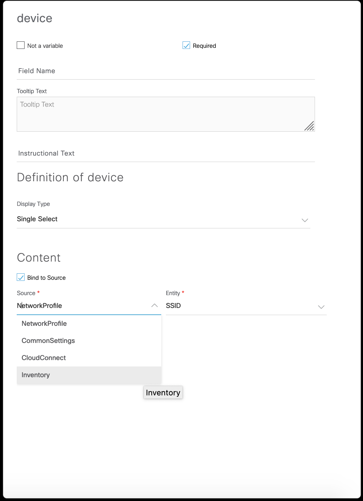

4. Choose the *Entity* to poll within the Source as shown below

   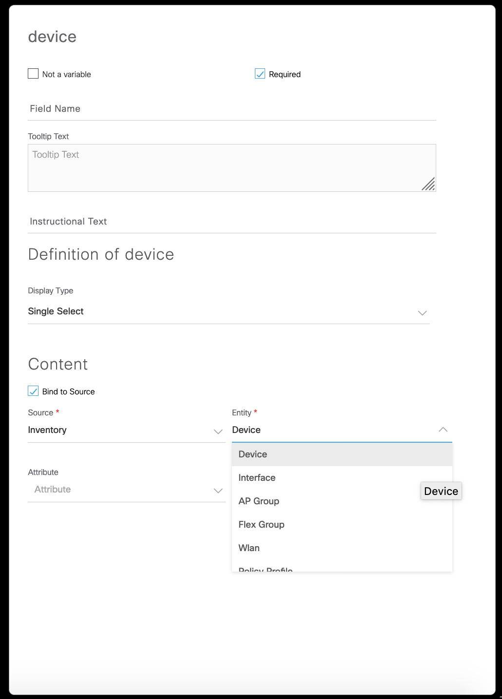

5. Choose the *Attribute* as shown below

   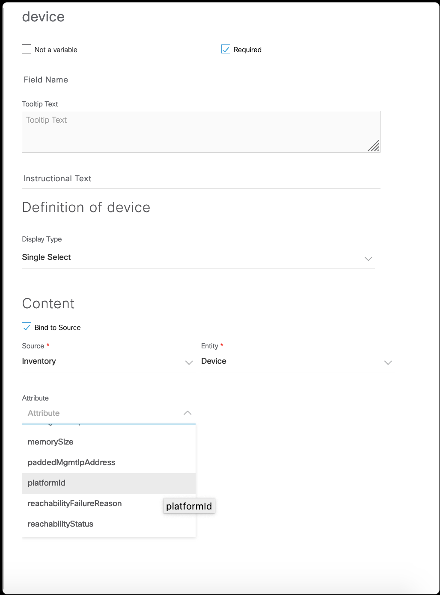

6. Save the Input Form through Actions menu on Input Form

#### System Variables

Within Catalyst Center it is possible to utilize Built-in System type variables for a number of values allowing you to address network settings within the design, to other interface information from devices. This example of code utilizes the `$__interface` built in variable to determine the characteristics of a port and then apply a macro to each port for a specific device.

```vtl
#foreach( $interface in $__interface )
  #if( $interface.portMode == "trunk" && $interface.interfaceType == "Physical")
    interface $interface.portName
     #uplink_physical
  #end
#end
```

```j2

  
    interface {{ interface.portName }}
     {{ access_physical() }}
  

```

This will be explained in more depth in the section [System Variables](./system-variables.md#cisco-catalyst-center-system-variables-published).

> [!IMPORTANT]
> **Feedback:** If you found this set of **labs** or **content** helpful, please fill in comments on this feedback form [give feedback](https://github.com/kebaldwi/DNAC-TEMPLATES/discussions/new?category=feedback-and-ideas).</br></br>
**Content Problems and Issues:** If you found an **issue** on the **lab** or **content** please fill in an [issue](https://github.com/kebaldwi/DNAC-TEMPLATES/issues/new) include what file, along with the issue you ran into. 

Special mention to: https://explore.cisco.com/dnac-use-cases/apache-velocity as Velocity examples and extrapolations were made using this documentation.

Special mention to: https://jinja.palletsprojects.com/en/3.0.x/templates as Jinja2 examples and extrapolations were made using this documentation.

> [**Return to Main Menu**](../README.md)